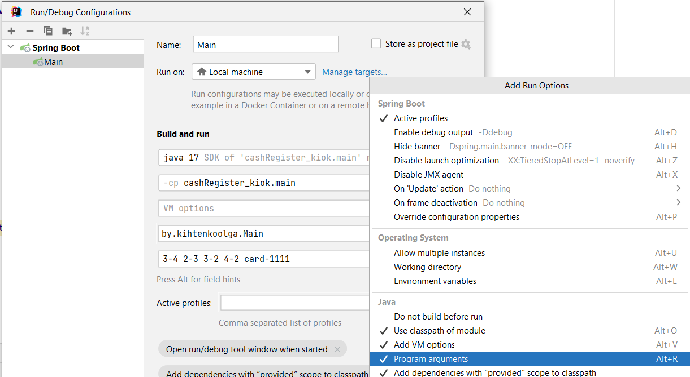

## Приложение создания чека покупок
Приложение, реализующее функционал формирования
чека в магазине
### Запуск
Приложение запускается java Main <набор_параметров>, где набор параметров в формате
itemId-quantity (itemId - идентификатор товара, quantity - его количество).
Например: java Main 3-1 2-5 5-1 card-1234 должен сформировать и вывести в консоль чек
содержащий в себе наименование товара с id=3 в количестве 1шт.

> Пример создания конфигурации запуска с использованием аргументов в intellij idea,
так же можно передать имя файла, напимер: Input.txt

> Для чтения из файла передавать в аргументы имя входного файла (вторым аргументом можно
передать имя выходного вайла)

> Для получения чека по GET запросу - в строке браузера: http://localhost:8081/check?itemId=4&itemId=1&itemId=3&card=1111

### БД
Используется PostgreSQL

Подключение описано в application.properties

создание таблицы и нескольких запросов в import.sql

Приложение использует Spring Data для взаимодействия с БД

### Архитектура проекта 
***Декоратор (чтение/вывод), фабричный метод (приведение к единому вормату), строитель (построение чека для разных платформ)***

Данные могут поступать из разных источников и выводиться в разные источники: консоли, файла -> для их обраьотки 
используется *декоратор*, который будет создавать обёртки для данных
из разных мест (разный формат), использовать *фабричный метод* и *строителя*, чтобы
привести к одному формату вывода (чек).

Фильтрация данных будет происходить при помощи *фабричного метода*, который приведет 
данные к нужному формату для создания чека.
(Декоратор создания ответа так же будет использовать фабрику и строителя)

После создания нужного формата данные будут передоваться *директору*, который будет 
использовать *строителей* для создания чека соответственного образца: консоль-файл, html